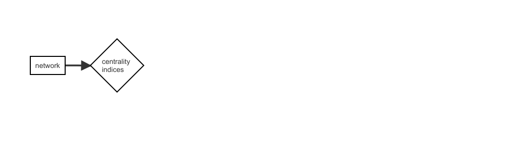
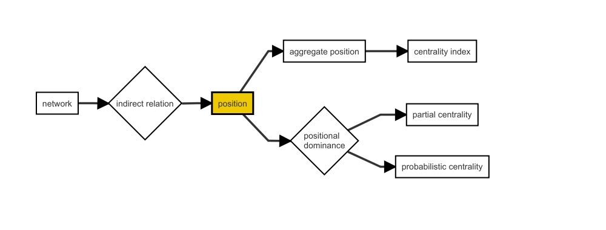
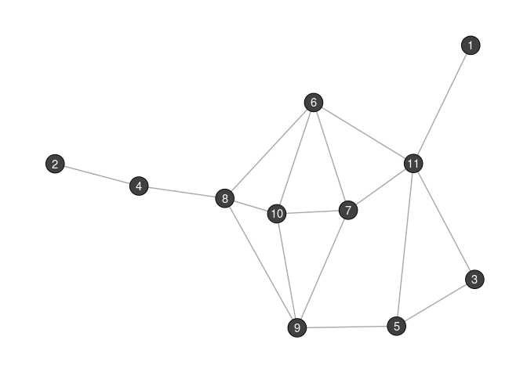

# netrankr 

[](https://cran.r-project.org/package=netrankr)
[](https://CRAN.R-project.org/package=netrankr)
[](https://travis-ci.org/schochastics/netrankr)
[](https://codecov.io/gh/schochastics/netrankr)

# Overview

The literature is flooded with centrality indices and new ones are
introduced on a regular basis. Although there exist several theoretical
and empirical guidelines on when to use certain indices, there still
exists plenty of ambiguity in the concept of network centrality. To
date, network centrality is nothing more than applying indices to a
network:



The only degree of freedom is the choice of index. The package comes
with an Rstudio addin (`index_builder()`), which allows to build or
choose from more than 20 different indices. Blindly (ab)using this
function is highly discouraged!

The `netrankr` package is based on the idea that centrality is more than
a conglomeration of indices. Decomposing them in a series of microsteps
offers the posibility to gradually add ideas about centrality, without
succumbing to trial-and-error approaches. Further, it allows for
alternative assessment methods which can be more general than the
index-driven approach:



The new approach is centered around the concept of *positions*, which
are defined as the relations and potential attributes of a node in a
network. The aggregation of the relations leads to the definition of
indices. However, positions can also be compared via *positional
dominance*, leading to partial centrality rankings and the option to
calculate probabilistic centrality rankings.

For a more detailed theoretical background, consult the
[Literature](#literature) at the end of this page.

------------------------------------------------------------------------

## Installation

To install from CRAN:

``` r
 install.packages("netrankr")
```

To install the developer version from github:

``` r
#install.packages("devtools")
devtools::install_github("schochastics/netrankr")
```

------------------------------------------------------------------------

## Simple Example

This example briefly explains some of the functionality of the package
and the difference to an index driven approach. For a more realistic
application see the use case vignette.

We work with the following small graph.

``` r
library(igraph)
library(netrankr)

g <- graph.empty(n = 11,directed = FALSE)
g <- add_edges(g,c(1,11,2,4,3,5,3,11,4,8,5,9,5,11,6,7,6,8,
                    6,10,6,11,7,9,7,10,7,11,8,9,8,10,9,10))
```



Say we are interested in the most central node of the graph and simply
compute some standard centrality scores with the `igraph` package.
Defining centrality indices in the `netrankr` package is explained in
the centrality indices vignette.

``` r
cent_scores <- data.frame(
   degree = degree(g),
   betweenness = round(betweenness(g),4),
   closeness = round(closeness(g),4),
   eigenvector = round(eigen_centrality(g)$vector,4),
   subgraph = round(subgraph_centrality(g),4))

# What are the most central nodes for each index?
apply(cent_scores,2,which.max)
#>      degree betweenness   closeness eigenvector    subgraph 
#>          11           8           6           7          10
```


As you can see, each index assigns the highest value to a different
vertex.

A more general assessment starts by calculating the neighborhood
inclusion preorder.

``` r
P <- neighborhood_inclusion(g)
P
#>    1 2 3 4 5 6 7 8 9 10 11
#> 1  0 0 1 0 1 1 1 0 0  0  1
#> 2  0 0 0 1 0 0 0 1 0  0  0
#> 3  0 0 0 0 1 0 0 0 0  0  1
#> 4  0 0 0 0 0 0 0 0 0  0  0
#> 5  0 0 0 0 0 0 0 0 0  0  0
#> 6  0 0 0 0 0 0 0 0 0  0  0
#> 7  0 0 0 0 0 0 0 0 0  0  0
#> 8  0 0 0 0 0 0 0 0 0  0  0
#> 9  0 0 0 0 0 0 0 0 0  0  0
#> 10 0 0 0 0 0 0 0 0 0  0  0
#> 11 0 0 0 0 0 0 0 0 0  0  0
```

[Schoch & Brandes (2016)](https://doi.org/10.1017/S0956792516000401)
showed that *N*(*u*) ⊆ *N*\[*v*\] (i.e. `P[u,v]=1`) implies
*c*(*u*) ≤ *c*(*v*) for centrality indices *c*, which are defined via
specific path algebras. These include many of the well-known measures
like closeness (and variants), betweenness (and variants) as well as
many walk-based indices (eigenvector and subgraph centrality, total
communicability,…).

Neighborhood-inclusion defines a partial ranking on the set of nodes.
Each ranking that is in accordance with this partial ranking yields a
proper centrality ranking. Each of these ranking can thus potentially be
the outcome of a centrality index.

Using rank intervals, we can examine the minimal and maximal possible
rank of each node. The bigger the intervals are, the more freedom exists
for indices to rank nodes differently.

``` r
plot(rank_intervals(P),cent.df = cent_scores,ties.method="average")
```


The potential ranks of nodes are not uniformly distributed in the
intervals. To get the exact probabilities, the function
`exact_rank_prob()` can be used.

``` r
res <- exact_rank_prob(P)
res
#> Number of possible centrality rankings:  739200 
#> Equivalence Classes (max. possible): 11 (11)
#> - - - - - - - - - - 
#> Rank Probabilities (rows:nodes/cols:ranks)
#>             1          2          3          4          5           6
#> 1  0.54545455 0.27272727 0.12121212 0.04545455 0.01298701 0.002164502
#> 2  0.27272727 0.21818182 0.16969697 0.12727273 0.09090909 0.060606061
#> 3  0.00000000 0.16363636 0.21818182 0.20909091 0.16883117 0.119047619
#> 4  0.00000000 0.02727273 0.05151515 0.07272727 0.09090909 0.106060606
#> 5  0.00000000 0.00000000 0.01818182 0.04545455 0.07532468 0.103463203
#> 6  0.00000000 0.05454545 0.08484848 0.10000000 0.10649351 0.108658009
#> 7  0.00000000 0.05454545 0.08484848 0.10000000 0.10649351 0.108658009
#> 8  0.00000000 0.02727273 0.05151515 0.07272727 0.09090909 0.106060606
#> 9  0.09090909 0.09090909 0.09090909 0.09090909 0.09090909 0.090909091
#> 10 0.09090909 0.09090909 0.09090909 0.09090909 0.09090909 0.090909091
#> 11 0.00000000 0.00000000 0.01818182 0.04545455 0.07532468 0.103463203
#>             7          8           9         10         11
#> 1  0.00000000 0.00000000 0.000000000 0.00000000 0.00000000
#> 2  0.03636364 0.01818182 0.006060606 0.00000000 0.00000000
#> 3  0.07272727 0.03636364 0.012121212 0.00000000 0.00000000
#> 4  0.11818182 0.12727273 0.133333333 0.13636364 0.13636364
#> 5  0.12727273 0.14545455 0.157575758 0.16363636 0.16363636
#> 6  0.10909091 0.10909091 0.109090909 0.10909091 0.10909091
#> 7  0.10909091 0.10909091 0.109090909 0.10909091 0.10909091
#> 8  0.11818182 0.12727273 0.133333333 0.13636364 0.13636364
#> 9  0.09090909 0.09090909 0.090909091 0.09090909 0.09090909
#> 10 0.09090909 0.09090909 0.090909091 0.09090909 0.09090909
#> 11 0.12727273 0.14545455 0.157575758 0.16363636 0.16363636
#> - - - - - - - - - - 
#> Relative Rank Probabilities (row ranked lower than col)
#>             1          2         3         4         5         6         7
#> 1  0.00000000 0.66666667 1.0000000 0.9523810 1.0000000 1.0000000 1.0000000
#> 2  0.33333333 0.00000000 0.6666667 1.0000000 0.9166667 0.8333333 0.8333333
#> 3  0.00000000 0.33333333 0.0000000 0.7976190 1.0000000 0.7500000 0.7500000
#> 4  0.04761905 0.00000000 0.2023810 0.0000000 0.5595238 0.4404762 0.4404762
#> 5  0.00000000 0.08333333 0.0000000 0.4404762 0.0000000 0.3750000 0.3750000
#> 6  0.00000000 0.16666667 0.2500000 0.5595238 0.6250000 0.0000000 0.5000000
#> 7  0.00000000 0.16666667 0.2500000 0.5595238 0.6250000 0.5000000 0.0000000
#> 8  0.04761905 0.00000000 0.2023810 0.5000000 0.5595238 0.4404762 0.4404762
#> 9  0.14285714 0.25000000 0.3571429 0.6250000 0.6785714 0.5714286 0.5714286
#> 10 0.14285714 0.25000000 0.3571429 0.6250000 0.6785714 0.5714286 0.5714286
#> 11 0.00000000 0.08333333 0.0000000 0.4404762 0.5000000 0.3750000 0.3750000
#>            8         9        10        11
#> 1  0.9523810 0.8571429 0.8571429 1.0000000
#> 2  1.0000000 0.7500000 0.7500000 0.9166667
#> 3  0.7976190 0.6428571 0.6428571 1.0000000
#> 4  0.5000000 0.3750000 0.3750000 0.5595238
#> 5  0.4404762 0.3214286 0.3214286 0.5000000
#> 6  0.5595238 0.4285714 0.4285714 0.6250000
#> 7  0.5595238 0.4285714 0.4285714 0.6250000
#> 8  0.0000000 0.3750000 0.3750000 0.5595238
#> 9  0.6250000 0.0000000 0.5000000 0.6785714
#> 10 0.6250000 0.5000000 0.0000000 0.6785714
#> 11 0.4404762 0.3214286 0.3214286 0.0000000
#> - - - - - - - - - - 
#> Expected Ranks (higher values are better)
#>        1        2        3        4        5        6        7        8 
#> 1.714286 3.000000 4.285714 7.500000 8.142857 6.857143 6.857143 7.500000 
#>        9       10       11 
#> 6.000000 6.000000 8.142857 
#> - - - - - - - - - - 
#> SD of Rank Probabilities
#>         1         2         3         4         5         6         7         8 
#> 0.9583148 1.8973666 1.7249667 2.5396850 2.1599320 2.7217941 2.7217941 2.5396850 
#>         9        10        11 
#> 3.1622777 3.1622777 2.1599320 
#> - - - - - - - - - -
```

For the graph `g` we can therefore come up with 739,200 indices that
would rank the nodes differently.

`rank.prob` contains the probabilities for each node to occupy a certain
rank. For instance, the probability for each node to be the most central
one is as follows.

``` r
round(res$rank.prob[ ,11],2)
#>    1    2    3    4    5    6    7    8    9   10   11 
#> 0.00 0.00 0.00 0.14 0.16 0.11 0.11 0.14 0.09 0.09 0.16
```

`relative.rank` contains the relative rank probabilities. An entry
`relative.rank[u,v]` indicates how likely it is that `v` is more central
than `u`.

``` r
# How likely is it, that 6 is more central than 3?
round(res$relative.rank[3,6],2)
#> [1] 0.75
```

`expected.ranks` contains the expected centrality ranks for all nodes.
They are derived on the basis of `rank.prob`.

``` r
round(res$expected.rank,2)
#>    1    2    3    4    5    6    7    8    9   10   11 
#> 1.71 3.00 4.29 7.50 8.14 6.86 6.86 7.50 6.00 6.00 8.14
```

The higher the value, the more central a node is expected to be.

**Note**: The set of rankings grows exponentially in the number of nodes
and the exact calculation becomes infeasible quite quickly and
approximations need to be used. Check the benchmark results for
guidelines.

------------------------------------------------------------------------

## Theoretical Background

`netrankr` is based on a series of papers that appeared in recent years.
If you want to learn more about the theoretical background of the
package, consult the following literature:

> Schoch, David. (2018). Centrality without Indices: Partial rankings
> and rank Probabilities in networks. *Social Networks*, **54**,
> 50-60.([link](https://doi.org/10.1016/j.socnet.2017.12.003))

> Schoch, David & Valente, Thomas W., & Brandes, Ulrik. (2017).
> Correlations among centrality indices and a class of uniquely ranked
> graphs. *Social Networks*, **50**,
> 46-54.([link](https://doi.org/10.1016/j.socnet.2017.03.010))

> Schoch, David & Brandes, Ulrik. (2016). Re-conceptualizing centrality
> in social networks. *European Journal of Appplied Mathematics*,
> **27**(6), 971–985.
> ([link](https://doi.org/10.1017/S0956792516000401))

> Brandes, Ulrik. (2016). Network Positions. *Methodological
> Innovations*, **9**, 2059799116630650.
> ([link](https://dx.doi.org/10.1177/2059799116630650))
