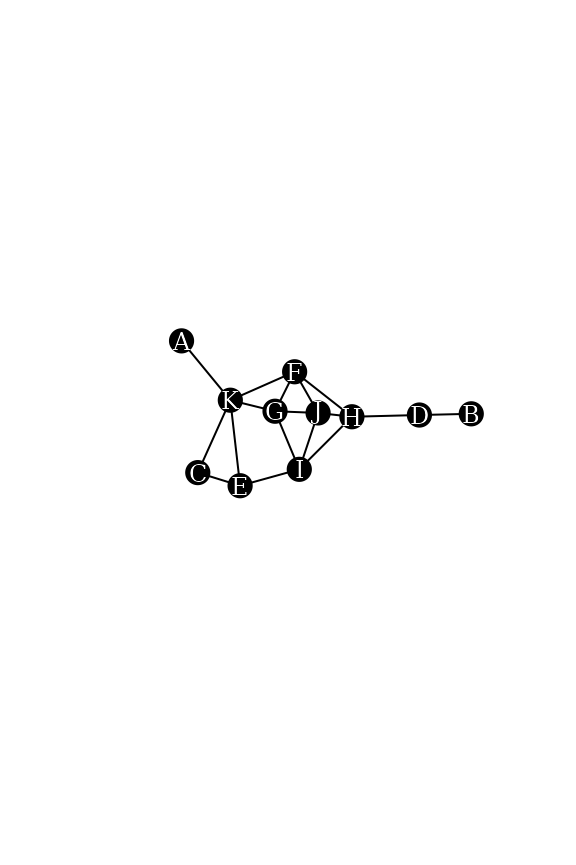
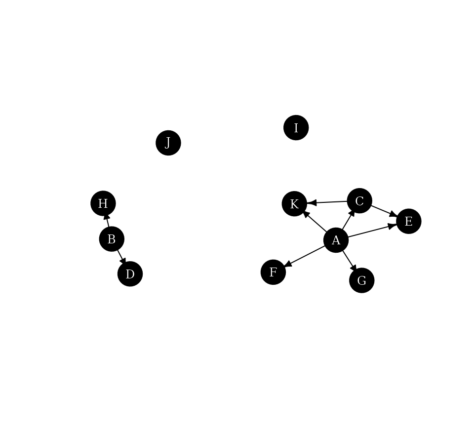

# Neighborhood-inclusion in networks

This vignette describes the concept of neighborhood-inclusion, its
connection with network centrality and gives some example use cases with
the `netrankr` package. The partial ranking induced by
neighborhood-inclusion can be used to assess [partial
centrality](https://schochastics.github.io/netrankr/articles/partial_centrality.md)
or compute [probabilistic
centrality](https://schochastics.github.io/netrankr/articles/probabilistic_cent.md).

------------------------------------------------------------------------

## Theoretical Background

In an undirected graph $`G=(V,E)`$, the *neighborhood* of a node
$`u \in V`$ is defined as
``` math
N(u)=\lbrace w : \lbrace u,w \rbrace \in E \rbrace
```
and its *closed neighborhood* as $`N[v]=N(v) \cup \lbrace v \rbrace`$.
If the neighborhood of a node $`u`$ is a subset of the closed
neighborhood of a node $`v`$, $`N(u)\subseteq N[v]`$, we speak of
*neighborhood inclusion*. This concept defines a dominance relation
among nodes in a network. We say that $`u`$ is *dominated* by $`v`$ if
$`N(u)\subseteq N[v]`$. Neighborhood-inclusion induces a partial ranking
on the vertices of a network. That is, (usually) some (if not most!)
pairs of vertices are incomparable, such that neither
$`N(u)\subseteq N[v]`$ nor $`N(v)\subseteq N[u]`$ holds. There is,
however, a special graph class where all pairs are comparable (found in
[this](https://schochastics.github.io/netrankr/articles/threshold_graph.md)
vignette).

The importance of neighborhood-inclusion is given by the following
result:

``` math
N(u)\subseteq N[v] \implies c(u)\leq c(v),
```
where $`c`$ is a centrality index defined on special path algebras.
These include many of the well known measures like closeness (and
variants), betweenness (and variants) as well as many walk-based indices
(eigenvector and subgraph centrality, total communicability,…).

Very informally, if $`u`$ is dominated by $`v`$, then u is less central
than $`v`$ no matter which centrality index is used, that fulfill the
requirement. While this is the key result, this short description leaves
out many theoretical considerations. These and more can be found in

> Schoch, David & Brandes, Ulrik. (2016). Re-conceptualizing centrality
> in social networks. *European Journal of Appplied Mathematics*,
> **27**(6), 971–985.
> ([link](https://doi.org/10.1017/S0956792516000401))

------------------------------------------------------------------------

## Neighborhood-inclusion in the `netrankr` Package

``` r

library(netrankr)
library(igraph)
set.seed(1886) #for reproducibility
```

We work with the following simple graph.

``` r

data("dbces11")
g <- dbces11

plot(g,
     vertex.color="black",vertex.label.color="white", vertex.size=16,vertex.label.cex=0.75,
     edge.color="black",
     margin=0,asp=0.5)
```



We can compare neighborhoods manually with the `neighborhood` function
of the `igraph` package. Note the `mindist` parameter to distinguish
between open and closed neighborhood.

``` r

u <- 3
v <- 5
Nu <- neighborhood(g,order=1,nodes=u,mindist = 1)[[1]] #N(u) 
Nv <- neighborhood(g,order=1,nodes=v,mindist = 0)[[1]] #N[v] 

Nu
```

    ## + 2/11 vertices, named, from 013399c:
    ## [1] E K

``` r

Nv
```

    ## + 4/11 vertices, named, from 013399c:
    ## [1] E C I K

Although it is obvious that `Nu` is a subset of `Nv`, we can verify it
as follows.

``` r

all(Nu%in%Nv)
```

    ## [1] TRUE

Checking all pairs of nodes can efficiently be done with the
[`neighborhood_inclusion()`](https://schochastics.github.io/netrankr/reference/neighborhood_inclusion.md)
function from the `netrankr` package.

``` r

P <- neighborhood_inclusion(g, sparse = FALSE)
P
```

    ##   A B C D E F G H I J K
    ## A 0 0 1 0 1 1 1 0 0 0 1
    ## B 0 0 0 1 0 0 0 1 0 0 0
    ## C 0 0 0 0 1 0 0 0 0 0 1
    ## D 0 0 0 0 0 0 0 0 0 0 0
    ## E 0 0 0 0 0 0 0 0 0 0 0
    ## F 0 0 0 0 0 0 0 0 0 0 0
    ## G 0 0 0 0 0 0 0 0 0 0 0
    ## H 0 0 0 0 0 0 0 0 0 0 0
    ## I 0 0 0 0 0 0 0 0 0 0 0
    ## J 0 0 0 0 0 0 0 0 0 0 0
    ## K 0 0 0 0 0 0 0 0 0 0 0

If an entry `P[u,v]` is equal to one, we have $`N(u)\subseteq N[v]`$.

The function
[`dominance_graph()`](https://schochastics.github.io/netrankr/reference/dominance_graph.md)
can alternatively be used to visualize the neighborhood inclusion as a
directed graph.

``` r

g.dom <- dominance_graph(P)

plot(g.dom,
     vertex.color="black",vertex.label.color="white", vertex.size=16, vertex.label.cex=0.75,
     edge.color="black", edge.arrow.size=0.5,margin=0,asp=0.5)
```



### Centrality and Neighborhood-inclusion

We start by calculating some standard measures of centrality found in
the `ìgraph` package for our example network. Note that the `netrankr`
package also implements a great variety of indices, but they need
further specifications described in
[this](https://schochastics.github.io/netrankr/articles/centrality_indices.md)
vignette.

``` r

cent.df <- data.frame(
  vertex=1:11,
  degree=degree(g),
  betweenness=betweenness(g),
  closeness=closeness(g),
  eigenvector=eigen_centrality(g)$vector,
  subgraph=subgraph_centrality(g)
)

#rounding for better readability
cent.df.rounded <- round(cent.df,4) 
cent.df.rounded
```

    ##   vertex degree betweenness closeness eigenvector subgraph
    ## A      1      1      0.0000    0.0370      0.2260   1.8251
    ## B      2      1      0.0000    0.0294      0.0646   1.5954
    ## C      3      2      0.0000    0.0400      0.3786   3.1486
    ## D      4      2      9.0000    0.0400      0.2415   2.4231
    ## E      5      3      3.8333    0.0500      0.5709   4.3871
    ## F      6      4      9.8333    0.0588      0.9847   7.8073
    ## G      7      4      2.6667    0.0526      1.0000   7.9394
    ## H      8      4     16.3333    0.0556      0.8386   6.6728
    ## I      9      4      7.3333    0.0556      0.9114   7.0327
    ## J     10      4      1.3333    0.0526      0.9986   8.2421
    ## K     11      5     14.6667    0.0556      0.8450   7.3896

Notice how for each centrality index, different vertices are considered
to be the most central node. The most central from degree to subgraph
centrality are $`11`$, $`8`$, $`6`$, $`7`$ and $`10`$. Note that only
*undominated* vertices can achieve the highest score for any reasonable
index. As soon as a vertex is dominated by at least one other, it will
always be ranked below the dominator. We can check for undominated
vertices simply by forming the row Sums in `P`.

``` r

which(rowSums(P)==0)
```

    ##  D  E  F  G  H  I  J  K 
    ##  4  5  6  7  8  9 10 11

8 nodes are undominated in the graph. It is thus entirely possible to
find indices that would also rank $`4, 5`$ and $`9`$ on top.

Besides the top ranked nodes, we can check if the entire partial ranking
`P` is preserved in each centrality ranking. If there exists a pair
$`u`$ and $`v`$ and index $`c()`$ such that $`N(u)\subseteq N[v]`$ but
$`c(v)>c(u)`$, we do not consider $`c`$ to be a valid index.

In our example, we considered vertex $`3`$ and $`5`$, where $`3`$ was
dominated by $`5`$. It is easy to verify that all centrality scores of
$`5`$ are in fact greater than the ones of $`3`$ by inspecting the
respective rows in the table. To check all pairs, we use the function
`is_preserved`. The function takes a partial ranking, as induced by
neighborhood inclusion, and a score vector of a centrality index and
checks if `P[i,j]==1 & scores[i]>scores[j]` is `FALSE` for all pairs `i`
and `j`.

``` r

apply(cent.df[,2:6],2,function(x) is_preserved(P,x))
```

    ##      degree betweenness   closeness eigenvector    subgraph 
    ##        TRUE        TRUE        TRUE        TRUE        TRUE

All considered indices preserve the neighborhood inclusion preorder on
the example network.

*NOTE*: Preserving neighborhood inclusion on **one** network does not
guarantee that an index preserves it on **all** networks. For more
details refer to the paper cited in the first section.
