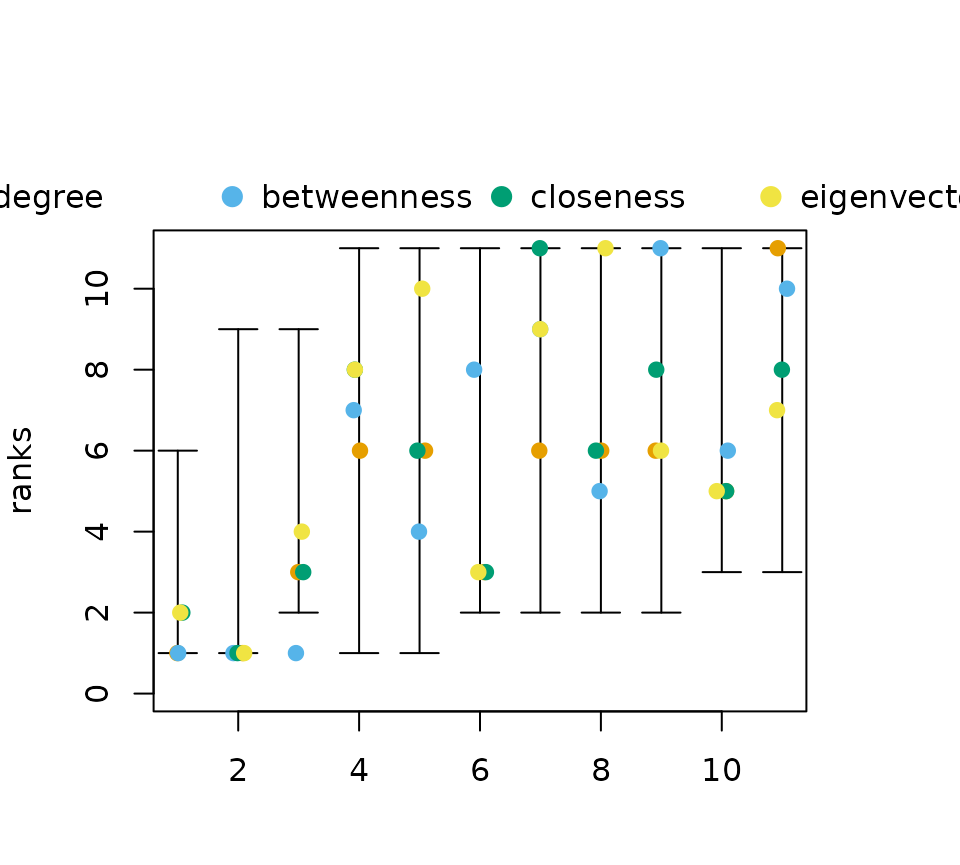
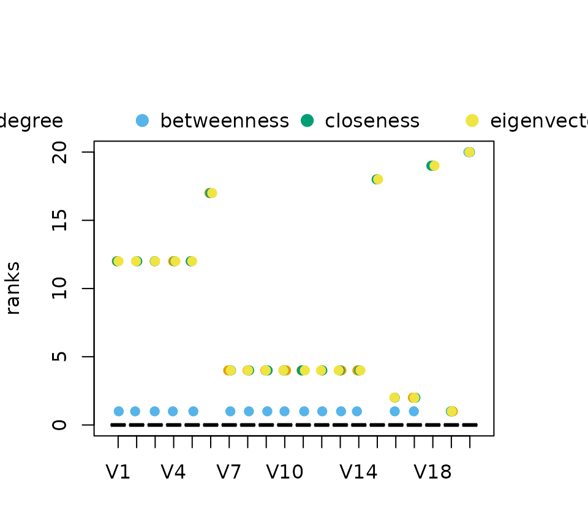

# Partial Centrality

This vignette describes some methods to analyse partial rankings as
obtained from
[neighborhood-inclusion](https://schochastics.github.io/netrankr/articles/neighborhood_inclusion.md)
or, more general, [positional
dominance](https://schochastics.github.io/netrankr/articles/positional_dominance.md).
More on the topic of partial rankings can be found in the following
literature.

> Schoch, David. (2018). Centrality without Indices: Partial rankings
> and rank Probabilities in networks. *Social Networks*, **54**,
> 50-60.([link](https://doi.org/10.1016/j.socnet.2017.12.003))

> Patil, G.P. & Taillie, C. (2004). Multiple Indicators, partially
> ordered sets, and linear extensions: Multi-criterion ranking and
> prioritization. *Environmental and Ecological Statistics*, **11**,
> 199-228
> ([link](https://link.springer.com/article/10.1023/B:EEST.0000027209.93218.d9))

------------------------------------------------------------------------

## Rank intervals

``` r

library(netrankr)
library(igraph)
library(magrittr)
```

The function
[`rank_intervals()`](https://schochastics.github.io/netrankr/reference/rank_intervals.md)
is used to calculate the maximal and minimal possible rank for each node
in any ranking that is in accordance with a given partial ranking.

``` r

data("dbces11")
g <- dbces11

#neighborhood inclusion 
P <- g %>% neighborhood_inclusion(sparse = FALSE)

#without %>% operator:
# P <- neighborhood_inclusion(g, sparse = FALSE)

rank_intervals(P)
```

    ## node:A rank interval: [1, 6]
    ## node:B rank interval: [1, 9]
    ## node:C rank interval: [2, 9]
    ## node:D rank interval: [2, 11]
    ## node:E rank interval: [3, 11]
    ## node:F rank interval: [2, 11]
    ## node:G rank interval: [2, 11]
    ## node:H rank interval: [2, 11]
    ## node:I rank interval: [1, 11]
    ## node:J rank interval: [1, 11]
    ## node:K rank interval: [3, 11]

The package uses the convention, that higher numerical ranks correspond
to top ranked position. The lowest possible rank is thus 1. The midpoint
of an interval should not be confused with the *expected rank* of nodes,
which is calculated with the function
[`exact_rank_prob()`](https://schochastics.github.io/netrankr/reference/exact_rank_prob.md).
See
[this](https://schochastics.github.io/netrankr/articles/probabilistic_cent.md)
vignette for more details.  
  
Rank intervals are useful to assess the ambiguity of ranking nodes. The
bigger the intervals are, the more freedom exists, e.g. for centrality
indices, to rank nodes differently.  
  
The intervals can be visualized with its own
[`plot()`](https://rdrr.io/r/graphics/plot.default.html) function. The
function can take a data frame of centrality scores as an additional
parameter `cent_scores`. The ranks of each node for each index are then
plotted within each interval. Again, the higher the numerical rank the
higher ranked the node is according to the index.

``` r

cent_scores <- data.frame(
   degree=degree(g),
   betweenness=round(betweenness(g),4),
   closeness=round(closeness(g),4),
   eigenvector=round(eigen_centrality(g)$vector,4))

rk_int <- rank_intervals(P)
plot(rk_int,cent_scores = cent_scores)
```



A small jitter effect is added to the points to reduce over-plotting.  
  
Note that you may encounter situations, where ranks of centralities may
fall outside of interval. This can happen in cases of ties in rankings,
especially for betweenness centrality. Betweenness is, so far, the only
index that does not *strictly* preserve neighborhood-inclusion. That is,
while
``` math
N(u)\subseteq N[v] \text{ and } N(v)\not\subseteq N[u] \implies c(u)<c(v)
```
holds for most indices, betweenness fails to fulfill this property.  
  
The intervals reduce to single points for [threshold
graphs](https://schochastics.github.io/netrankr/articles/threshold_graph.md),
since all nodes are pairwise comparable by neighborhood-inclusion.

``` r

set.seed(123)
tg <- threshold_graph(20,0.2)

#neighborhood inclusion 
P <- tg %>% neighborhood_inclusion(sparse = FALSE)

#without %>% operator:
# P <- neighborhood_inclusion(tg,sparse = FALSE)
plot(rank_intervals(P))
```


The described betweenness inconsistancy is most evident for threshold
graphs as shown in the rank intervals below.

``` r

cent_scores <- data.frame(
   degree=degree(tg),
   betweenness=round(betweenness(tg),4),
   closeness=round(closeness(tg),4),
   eigenvector=round(eigen_centrality(tg)$vector,4))


plot(rank_intervals(P),cent_scores = cent_scores)
```


