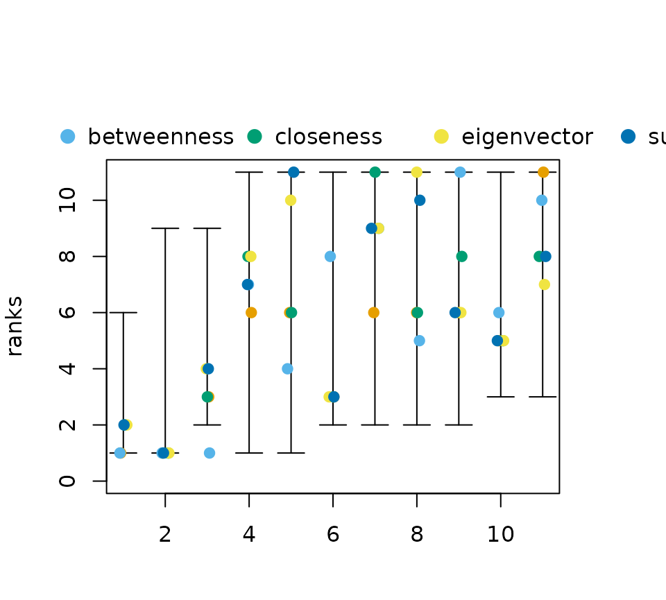

# Probabilistic Centrality

This vignette describes methods to analyse all possible centrality
rankings of a network at once. To do so, a partial rankings as computed
from
[neighborhood-inclusion](https://schochastics.github.io/netrankr/articles/neighborhood_inclusion.md)
or, more general, [positional
dominance](https://schochastics.github.io/netrankr/articles/positional_dominance.md)
is needed. In this vignette we focus on neighborhood-inclusion but note
that all considered methods are readily applicable for positional
dominance. For more examples consult the tutorial.

------------------------------------------------------------------------

## Theoretical Background

Neighborhood-inclusion or induces a partial ranking on the vertices of a
graph $`G=(V,E)`$. We write $`u\leq v`$ if $`N(u)\subseteq N[v]`$ holds
for two vertices $`u,v \in V`$. From the fact that
``` math
u\leq v \implies c(u) \leq c(v)
```
holds for any centrality index $`c:V\to \mathbb{R}`$, we can
characterize the set of all *possible* centrality based node rankings.
Namely as the set of rankings that extend the partial ranking “$`\leq`$”
to a (complete) ranking.  
  
A node ranking can be defined as a mapping
``` math
rk: V \to \{1,\ldots,n\},
```
where we use the convention that $`u`$ is the top ranked node if
$`rk(u)=n`$ and the bottom ranked one if $`rk(u)=1`$. The set of all
possible rankings can then be characterized as
``` math
\mathcal{R}(\leq)=\{rk:V \to \{1,\ldots,n\}\; : \; u\leq v \implies rk(u)\leq rk(v)\}.
```
This set contains **all** rankings that could be obtained with a
centrality index.  
  
Once $`\mathcal{R}(\leq)`$ is calculated, it can be used for a
probabilistic assessment of centrality, analyzing all possible rankings
at once. Examples include *relative rank probabilities* (How likely is
it, that a node $`u`$ is more central than another node $`v`$?) or
*expected ranks* (How central do we expect a node $`u`$ to be).  
  
It most be noted though, that deriving the set $`\mathcal{R}(\leq)`$
quickly becomes infeasible for larger networks, and one has to resort to
approximation methods. These and more theoretical details can be found
in

> Schoch, David. (2018). Centrality without Indices: Partial rankings
> and rank Probabilities in networks. *Social Networks*, **54**,
> 50-60.([link](https://doi.org/10.1016/j.socnet.2017.12.003))

------------------------------------------------------------------------

## Exact Probabilities in the `netrankr` Package

``` r

library(netrankr)
library(igraph)
library(magrittr)
```

Before calculating any probabilities consider the following example
graph and the rankings induced by various centrality indices, shown as
rank intervals (consult
[this](https://schochastics.github.io/netrankr/articles/partial_centrality.md)
vignette for details).

``` r

data("dbces11")
g <- dbces11

#neighborhood inclusion 
P <- g %>% neighborhood_inclusion(sparse = FALSE)

#without %>% operator:
# P <- neighborhood_inclusion(g)

cent_scores <- data.frame(
   degree=degree(g),
   betweenness=round(betweenness(g),4),
   closeness=round(closeness(g),4),
   eigenvector=round(eigen_centrality(g)$vector,4),
   subgraph=round(subgraph_centrality(g),4))

plot(rank_intervals(P),cent_scores = cent_scores)
```



Notice how all five indices rank a different vertex as the most central
one.  
  
In the following subsections the output of the function
[`exact_rank_prob()`](https://schochastics.github.io/netrankr/reference/exact_rank_prob.md)
are described which may help to circumvent the potential arbitrariness
of index induced rankings. But first, let us briefly look at all the
return values.

``` r

res <- exact_rank_prob(P)
res
```

    ## Number of possible centrality rankings:  739200 
    ## Equivalence Classes (max. possible): 11 (11)
    ## - - - - - - - - - - 
    ## Rank Probabilities (rows:nodes/cols:ranks)
    ##            1          2          3          4          5           6          7
    ## A 0.54545455 0.27272727 0.12121212 0.04545455 0.01298701 0.002164502 0.00000000
    ## B 0.27272727 0.21818182 0.16969697 0.12727273 0.09090909 0.060606061 0.03636364
    ## C 0.00000000 0.16363636 0.21818182 0.20909091 0.16883117 0.119047619 0.07272727
    ## D 0.00000000 0.02727273 0.05151515 0.07272727 0.09090909 0.106060606 0.11818182
    ## E 0.00000000 0.00000000 0.01818182 0.04545455 0.07532468 0.103463203 0.12727273
    ## F 0.00000000 0.05454545 0.08484848 0.10000000 0.10649351 0.108658009 0.10909091
    ## G 0.00000000 0.05454545 0.08484848 0.10000000 0.10649351 0.108658009 0.10909091
    ## H 0.00000000 0.02727273 0.05151515 0.07272727 0.09090909 0.106060606 0.11818182
    ## I 0.09090909 0.09090909 0.09090909 0.09090909 0.09090909 0.090909091 0.09090909
    ## J 0.09090909 0.09090909 0.09090909 0.09090909 0.09090909 0.090909091 0.09090909
    ## K 0.00000000 0.00000000 0.01818182 0.04545455 0.07532468 0.103463203 0.12727273
    ##            8           9         10         11
    ## A 0.00000000 0.000000000 0.00000000 0.00000000
    ## B 0.01818182 0.006060606 0.00000000 0.00000000
    ## C 0.03636364 0.012121212 0.00000000 0.00000000
    ## D 0.12727273 0.133333333 0.13636364 0.13636364
    ## E 0.14545455 0.157575758 0.16363636 0.16363636
    ## F 0.10909091 0.109090909 0.10909091 0.10909091
    ## G 0.10909091 0.109090909 0.10909091 0.10909091
    ## H 0.12727273 0.133333333 0.13636364 0.13636364
    ## I 0.09090909 0.090909091 0.09090909 0.09090909
    ## J 0.09090909 0.090909091 0.09090909 0.09090909
    ## K 0.14545455 0.157575758 0.16363636 0.16363636
    ## - - - - - - - - - - 
    ## Relative Rank Probabilities (row ranked lower than col)
    ##            A          B         C         D         E         F         G
    ## A 0.00000000 0.66666667 1.0000000 0.9523810 1.0000000 1.0000000 1.0000000
    ## B 0.33333333 0.00000000 0.6666667 1.0000000 0.9166667 0.8333333 0.8333333
    ## C 0.00000000 0.33333333 0.0000000 0.7976190 1.0000000 0.7500000 0.7500000
    ## D 0.04761905 0.00000000 0.2023810 0.0000000 0.5595238 0.4404762 0.4404762
    ## E 0.00000000 0.08333333 0.0000000 0.4404762 0.0000000 0.3750000 0.3750000
    ## F 0.00000000 0.16666667 0.2500000 0.5595238 0.6250000 0.0000000 0.5000000
    ## G 0.00000000 0.16666667 0.2500000 0.5595238 0.6250000 0.5000000 0.0000000
    ## H 0.04761905 0.00000000 0.2023810 0.5000000 0.5595238 0.4404762 0.4404762
    ## I 0.14285714 0.25000000 0.3571429 0.6250000 0.6785714 0.5714286 0.5714286
    ## J 0.14285714 0.25000000 0.3571429 0.6250000 0.6785714 0.5714286 0.5714286
    ## K 0.00000000 0.08333333 0.0000000 0.4404762 0.5000000 0.3750000 0.3750000
    ##           H         I         J         K
    ## A 0.9523810 0.8571429 0.8571429 1.0000000
    ## B 1.0000000 0.7500000 0.7500000 0.9166667
    ## C 0.7976190 0.6428571 0.6428571 1.0000000
    ## D 0.5000000 0.3750000 0.3750000 0.5595238
    ## E 0.4404762 0.3214286 0.3214286 0.5000000
    ## F 0.5595238 0.4285714 0.4285714 0.6250000
    ## G 0.5595238 0.4285714 0.4285714 0.6250000
    ## H 0.0000000 0.3750000 0.3750000 0.5595238
    ## I 0.6250000 0.0000000 0.5000000 0.6785714
    ## J 0.6250000 0.5000000 0.0000000 0.6785714
    ## K 0.4404762 0.3214286 0.3214286 0.0000000
    ## - - - - - - - - - - 
    ## Expected Ranks (higher values are better)
    ##        A        B        C        D        E        F        G        H 
    ## 1.714286 3.000000 4.285714 7.500000 8.142857 6.857143 6.857143 7.500000 
    ##        I        J        K 
    ## 6.000000 6.000000 8.142857 
    ## - - - - - - - - - - 
    ## SD of Rank Probabilities
    ##         A         B         C         D         E         F         G         H 
    ## 0.9583148 1.8973666 1.7249667 2.5396850 2.1599320 2.7217941 2.7217941 2.5396850 
    ##         I         J         K 
    ## 3.1622777 3.1622777 2.1599320 
    ## - - - - - - - - - -

The function returns an object of type which contains the result of a
full probabilistic rank analysis. The specific list entries are
discussed in the following subsections.

### Rank Probabilities

Instead of insisting on fixed ranks of nodes as given by indices, we can
use *rank probabilities* to assess the likelihood of certain rank.
Formally, rank probabilities are simply defined as
``` math
P(rk(u)=k)=\frac{\lvert \{rk \in  \mathcal{R}(\leq) \; : \; rk(u)=k\} \rvert}{\lvert \mathcal{R}(\leq) \rvert}.
```
Rank probabilities are given by the return value `rank.prob` of the
[`exact_rank_prob()`](https://schochastics.github.io/netrankr/reference/exact_rank_prob.md)
function.

``` r

rp <- round(res$rank.prob,2)
rp
```

    ##      1    2    3    4    5    6    7    8    9   10   11
    ## A 0.55 0.27 0.12 0.05 0.01 0.00 0.00 0.00 0.00 0.00 0.00
    ## B 0.27 0.22 0.17 0.13 0.09 0.06 0.04 0.02 0.01 0.00 0.00
    ## C 0.00 0.16 0.22 0.21 0.17 0.12 0.07 0.04 0.01 0.00 0.00
    ## D 0.00 0.03 0.05 0.07 0.09 0.11 0.12 0.13 0.13 0.14 0.14
    ## E 0.00 0.00 0.02 0.05 0.08 0.10 0.13 0.15 0.16 0.16 0.16
    ## F 0.00 0.05 0.08 0.10 0.11 0.11 0.11 0.11 0.11 0.11 0.11
    ## G 0.00 0.05 0.08 0.10 0.11 0.11 0.11 0.11 0.11 0.11 0.11
    ## H 0.00 0.03 0.05 0.07 0.09 0.11 0.12 0.13 0.13 0.14 0.14
    ## I 0.09 0.09 0.09 0.09 0.09 0.09 0.09 0.09 0.09 0.09 0.09
    ## J 0.09 0.09 0.09 0.09 0.09 0.09 0.09 0.09 0.09 0.09 0.09
    ## K 0.00 0.00 0.02 0.05 0.08 0.10 0.13 0.15 0.16 0.16 0.16

Entries `rp[u,k]` correspond to $`P(rk(u)=k)`$.  
  
The most interesting probabilities are certainly $`P(rk(u)=n)`$, that is
how likely is it for a node to be the most central.

``` r

rp[,11]
```

    ##    A    B    C    D    E    F    G    H    I    J    K 
    ## 0.00 0.00 0.00 0.14 0.16 0.11 0.11 0.14 0.09 0.09 0.16

Recall from the previous section that we found five indices that ranked
$`6,7,8,10`$ and $`11`$ on top. The probability tell us now, how likely
it is to find an index that rank these nodes on top. In this case, node
$`11`$ has the highest probability to be the most central node.

### Relative Rank Probabilities

In some cases, we might not necessarily be interested in a complete
ranking of nodes, but only in the relative position of a subset of
nodes. This idea leads to *relative rank probabilities*, that is
formally defined as
``` math
P(rk(u)\leq rk(v))=\frac{\lvert \{rk \in  \mathcal{R}(\leq) \; : \; rk(u)\leq rk(v)\} \rvert}{\lvert \mathcal{R}(\leq) \rvert}.
```
Relative rank probabilities are given by the return value
`relative.rank` of the
[`exact_rank_prob()`](https://schochastics.github.io/netrankr/reference/exact_rank_prob.md)
function.

``` r

rrp <- round(res$relative.rank,2)
rrp
```

    ##      A    B    C    D    E    F    G    H    I    J    K
    ## A 0.00 0.67 1.00 0.95 1.00 1.00 1.00 0.95 0.86 0.86 1.00
    ## B 0.33 0.00 0.67 1.00 0.92 0.83 0.83 1.00 0.75 0.75 0.92
    ## C 0.00 0.33 0.00 0.80 1.00 0.75 0.75 0.80 0.64 0.64 1.00
    ## D 0.05 0.00 0.20 0.00 0.56 0.44 0.44 0.50 0.38 0.38 0.56
    ## E 0.00 0.08 0.00 0.44 0.00 0.38 0.38 0.44 0.32 0.32 0.50
    ## F 0.00 0.17 0.25 0.56 0.62 0.00 0.50 0.56 0.43 0.43 0.62
    ## G 0.00 0.17 0.25 0.56 0.62 0.50 0.00 0.56 0.43 0.43 0.62
    ## H 0.05 0.00 0.20 0.50 0.56 0.44 0.44 0.00 0.38 0.38 0.56
    ## I 0.14 0.25 0.36 0.62 0.68 0.57 0.57 0.62 0.00 0.50 0.68
    ## J 0.14 0.25 0.36 0.62 0.68 0.57 0.57 0.62 0.50 0.00 0.68
    ## K 0.00 0.08 0.00 0.44 0.50 0.37 0.37 0.44 0.32 0.32 0.00

Entries `rrp[u,v]` correspond to $`P(rk(u)\leq rk(v))`$.  
  
The more a value `rrp[u,v]` deviates from $`0.5`$ towards $`1`$, the
more confidence we gain that a node $`v`$ is more central than a node
$`u`$.

\###Expected Ranks The *expected rank* of a node in centrality rankings
is defined as the expected value of the rank probability distribution.
That is,
``` math
\rho(u)=\sum_{k=1}^n k\cdot P(rk(u)=k).
```
Expected ranks are given by the return value `expected.rank` of the
[`exact_rank_prob()`](https://schochastics.github.io/netrankr/reference/exact_rank_prob.md)
function.

``` r

ex_rk <- round(res$expected.rank,2)
ex_rk
```

    ##    A    B    C    D    E    F    G    H    I    J    K 
    ## 1.71 3.00 4.29 7.50 8.14 6.86 6.86 7.50 6.00 6.00 8.14

As a reminder, the higher the numeric rank, the more central a node is.
In this case, node $`11`$ has the highest expected rank in any
centrality ranking.
