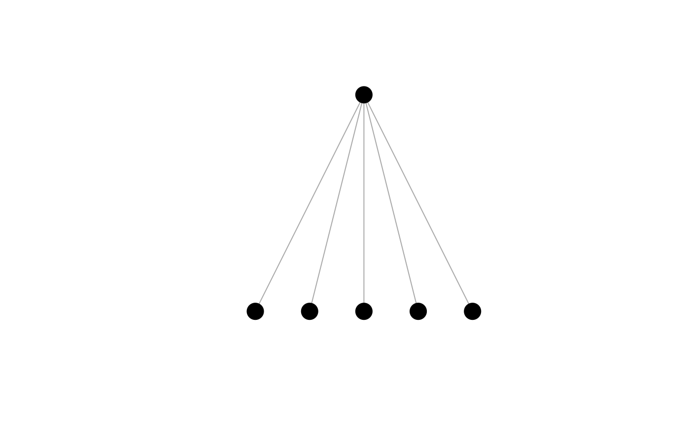
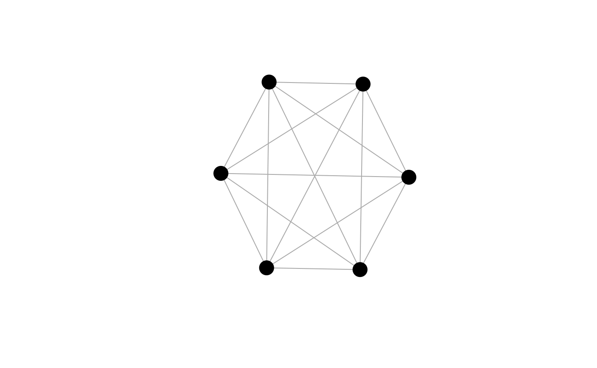

# Uniquely ranked graphs

This vignette introduces *threshold graphs*, a class of graphs with a
unique centrality ranking and relevant functions from the `netrankr`
package to work with this class of graphs.

------------------------------------------------------------------------

## Theoretical Background

A threshold graph is a graph, where all nodes are pairwise comparable by
neighborhood inclusion. Formally,
``` math
\forall u,v \in V: N(u) \subseteq N[v] \; \lor \; N(v) \subseteq N[u].
```

According to
[this](https://schochastics.github.io/netrankr/articles/neighborhood_inclusion.md)
vignette, it is thus clear that all centrality indices induce the same
ranking on a threshold graph. More technical details on threshold graphs
and results related to centrality can be found in

> Schoch, David & Valente, Thomas W., & Brandes, Ulrik. (2017).
> Correlations among centrality indices and a class of uniquely ranked
> graphs. *Social Networks*, **50**,
> 46-54.([link](https://doi.org/10.1016/j.socnet.2017.03.010))

------------------------------------------------------------------------

## Uniquely Ranked Graphs in the `netrankr` Package

``` r

library(netrankr)
library(igraph)
set.seed(1886) #for reproducibility
```

Threshold graphs on $`n`$ vertices can be constructed iteratively with a
sequence of $`0`$’s and $`1`$’s. For each $`0`$, an isolated vertex is
inserted and for each $`1`$ a vertex that connects to all previously
inserted one’s. This iterative process is implemented in the
`threshold_graph` function. The parameter `n` is used to set the desired
number of vertices. The parameter `p` is the probability that a
dominated vertex is inserted in each step. This parameter roughly
equates to the density of the network.

``` r

 g1 <- threshold_graph(500,0.4)
 g2 <- threshold_graph(500,0.05)
 
 c(round(edge_density(g1),2), round(edge_density(g2),2))
```

    ## [1] 0.41 0.03

The class of threshold graphs includes various well-known graphs, for
instance star shaped and complete networks. This graphs can be
constructed with `p=0` and `p=1` respectively.

``` r

star <- threshold_graph(6,0) 
complete <- threshold_graph(6,1)
plot(star,vertex.label=NA,vertex.color="black")
plot(complete,vertex.label=NA,vertex.color="black")
```



To check that all pairs are comparable by neighborhood inclusion, we can
use the function `comparable_pairs`. The function computes the density
of the underlying undirected graph induced by the neighborhood-inclusion
relation.

``` r

g <- threshold_graph(10,0.4)
P <- neighborhood_inclusion(g)
comparable_pairs(P)
```

    ## [1] 1

## Correlation and Threshold Graphs

We construct a random threshold graph and calculate some standard
measures of centrality that are included in the `igraph` package.

``` r

g <- threshold_graph(100,0.1)

cent.df <- data.frame(
  degree=degree(g),
  betweenness=betweenness(g),
  closeness=closeness(g),
  eigenvector=round(eigen_centrality(g)$vector,8),
  subgraph=subgraph_centrality(g)
)
```

We expect, that all indices are perfectly rank correlated since all
pairs of nodes are comparable by neighborhood-inclusion.

``` r

cor.mat <- cor(round(cent.df,8),method="kendall")
cor.mat <- round(cor.mat,2)
cor.mat
```

    ##             degree betweenness closeness eigenvector subgraph
    ## degree        1.00        0.52      1.00        1.00     0.96
    ## betweenness   0.52        1.00      0.52        0.52     0.50
    ## closeness     1.00        0.52      1.00        1.00     0.96
    ## eigenvector   1.00        0.52      1.00        1.00     0.96
    ## subgraph      0.96        0.50      0.96        0.96     1.00

We, however, obtain correlations that are not equal to one. This is due
to the definition of Kendall’s (tie corrected) $`\tau`$. Before going
into detail, consider the following cases which can arise when comparing
two scores of indices `x` and `y`.

- concordant: `x[i]>x[j] & y[i]>y[j]` or `x[i]<x[j] & y[i]<y[j]`
- discordant: `x[i]>x[j] & y[i]<y[j]` or `x[i]>x[j] & y[i]<y[j]`
- tied: `x[i]=x[j] & y[i]=y[j]`
- left/right ties: `x[i]=x[j] & y[i]!=y[j]` or `x[i]!=x[j] & y[i]=y[j]`

Kendall’s $`\tau`$ considers left and right ties as correlation
reducing. That is if two vertices are tied in one ranking, but not the
other, the correlations is weakened. Left and right ties are, however,
not forbidden according to the neighborhood inclusion property. The only
forbidden case are discordant pairs. That is, $`N(u)\subseteq N[v]`$ can
not result in $`c(u)>c(v)`$ but it may result in $`c(u)=c(v)`$. Also,
one can argue that left and right ties distinguish between fine/coarse
grained indices.

`netrankr` comes with a function called `compare_ranks` which calculates
all occurrences of the above cases. Simply counting the cases instead of
aggregating them will help circumvent the problem of possibly
misinterpreting correlation measures.

``` r

comp <- compare_ranks(cent.df$degree,cent.df$betweenness)
unlist(comp)
```

    ## concordant discordant       ties       left      right 
    ##       1206          0        535          0       3209

Notice that there is a high number of right ties which influences the
correlation if measured with Kendall’s $`\tau`$. However, there do not
exist any discordant pairs for any pair of indices.

``` r

dis.pairs <- matrix(0,5,5)
dis.pairs[1,] <- apply(cent.df,2,
                       function(x)compare_ranks(cent.df$degree,x)$discordant)
dis.pairs[2,] <- apply(cent.df,2,
                       function(x)compare_ranks(cent.df$betweenness,x)$discordant)
dis.pairs[3,] <- apply(cent.df,2,
                       function(x)compare_ranks(cent.df$closeness,x)$discordant)
dis.pairs[4,] <- apply(cent.df,2,
                       function(x)compare_ranks(cent.df$eigenvector,x)$discordant)
dis.pairs[5,] <- apply(cent.df,2,
                       function(x)compare_ranks(cent.df$subgraph,x)$discordant)
dis.pairs
```

    ##      [,1] [,2] [,3] [,4] [,5]
    ## [1,]    0    0    0    0    0
    ## [2,]    0    0    0    0    0
    ## [3,]    0    0    0    0    0
    ## [4,]    0    0    0    0    0
    ## [5,]    0    0    0    0    0

Although Kendall’s $`\tau`$ suggests that the correlations among indices
can be low, we see that there do not exist any discordant pairs on
threshold graphs.

## Distances from a threshold graph

As it is always the case with artificial graph structures, it is rather
unlikely to encounter threshold graphs in the wild. The best we can hope
for is to be *close* to a threshold graph. This is based on the
intuition that the closer a graph is to be a threshold graph, the more
of its properties resemble one. The closer we are, the more correlated
we assume centrality indices to be. The further away we are, the more
disagreement we will find among indices. The problematic point is: how
do we define *being close to a threshold graph*. An in depth discussion
of possible measures can be found in the paper mentioned at the
beginning of this vignette.

`netrankr` implements one function that can be used to assess the
distance of arbitrary graphs to threshold graphs. The so called
*majorization gap* operates solely on the degree sequence and determines
the number of entries that have to be changed in order to obtain the
degree sequence of a threshold graph. Changing can, however, not be done
arbitrarily. The only allowed operation is to lower the degree of one
vertex and simultaneously increase the degree of another. For threshold
graphs, this measure is obviously zero.

``` r

tg <- threshold_graph(200,0.2)
majorization_gap(g)
```

    ## [1] 0

By default, `majorization_gap` is normalized by the number of edges.

``` r

data("dbces11")
g <- dbces11

majorization_gap(g)
```

    ## [1] 0.3529412

In this example, around 35% of all entries have to be changed in order
to obtain a threshold graph. The normalization is done to compare the
majorization gap across networks with different sizes. To obtain the raw
number of changes, set `norm=FALSE`.

``` r

majorization_gap(g,norm = FALSE)
```

    ## [1] 6

The majorization gap serves as an indicator for how much variance we can
expect in the rankings of different centrality indices. The lower it is,
the closer we are to a threshold graph where only one ranking is
possible. The further away we are, the more degrees of freedom exist to
rank nodes differently and we will generally observe lower correlations.
For more details, again, refer to the mentioned paper at the beginning.
