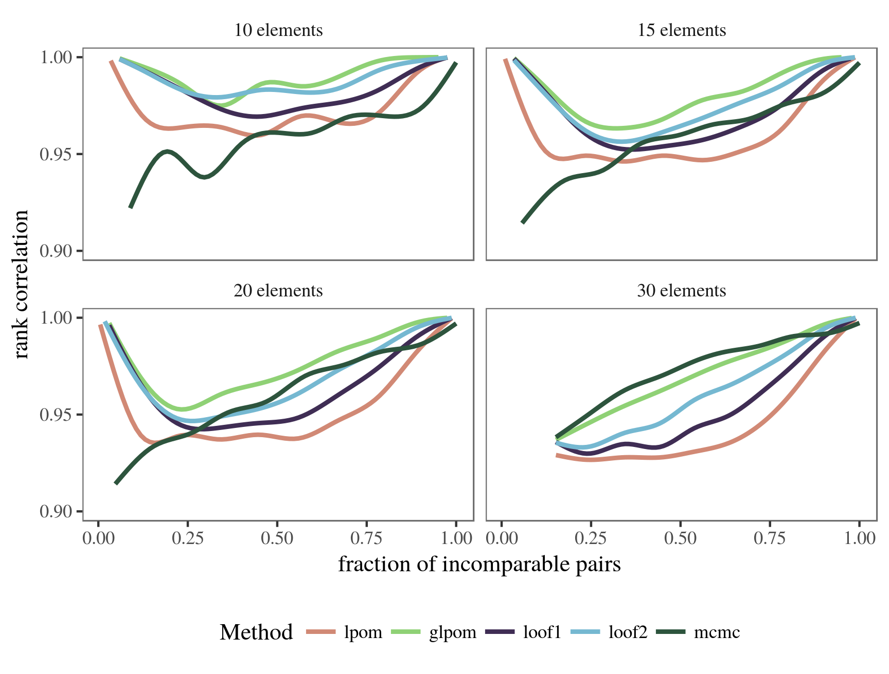
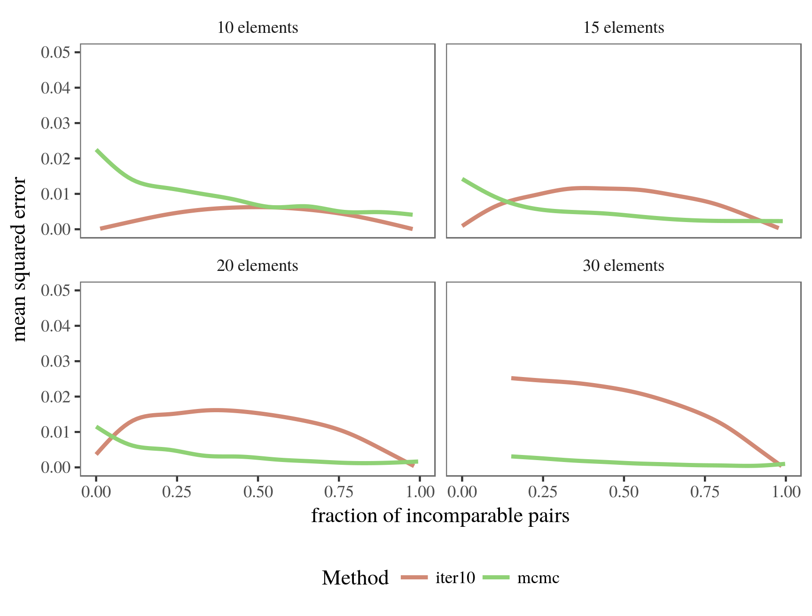
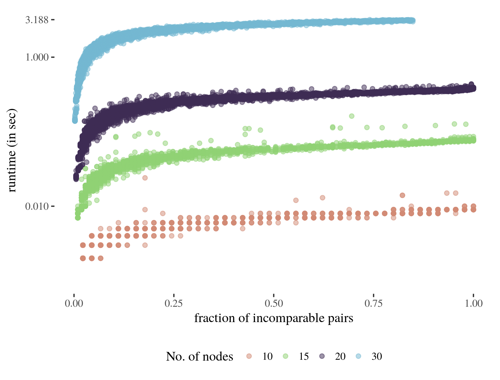

```{r setup,echo=FALSE}
knitr::opts_chunk$set(out.width = "100%")
```

Some of the methods provided in `netrankr` are computationally very expensive.
Computing all rankings of a partial ranking, for instance, is a NP-hard problem
such that using the function `exact_rank_prob()` quickly becomes infeasible. 
This article provides some guidelines for when the use of this function is possible.
Additionally, the quality of the approximation functions `approx_*` for **expected ranks**
and **relative rank probabilities** are assessed.


________________________________________________________________________________

## Runtimes exact probabilities

The below figure shows the runtime of `exact_rank_prob()` for a sample of
13,000 partial rankings with 10 to 30 nodes and varying degree of completeness.

```{r runtime, echo=FALSE}
knitr::include_graphics("runtimes_exact.png")
```

Not surprisingly, the runtime increases quickly with the number of nodes and the
number of incomparable pairs in the partial ranking. As a very crude rule of thumb:
As long as your partial ranking has less than 30 elements, it is always save to run
`exact_rank_prob()`. Beyond 30 elements, it is advisable to only use the function if
a high fraction of pairs of elements is already comparable. The more elements, 
the higher this fraction should be.

________________________________________________________________________________

## Approximating expected ranks

`netrankr` implements five methods to approximate expected ranks which are given
by the functions `approx_rank_expected()` and `mcmc_rank_prob()`. 

```{r qual_exp_mse, echo=FALSE}
knitr::include_graphics("quality_expected_mse.png")
```

```{r qual_exp_cor, echo=FALSE}

```
________________________________________________________________________________

## Approximating expected ranks

```{r qual_rel, echo=FALSE}
knitr::include_graphics("quality_relative_mse.png")
```

```{r qual_rel2, echo=FALSE}

```

## Runtime MCMC

```{r runtime_mcmc, echo=FALSE}

```

________________________________________________________________________________

## Session info
```{r session,echo=FALSE}
sessionInfo()
```
