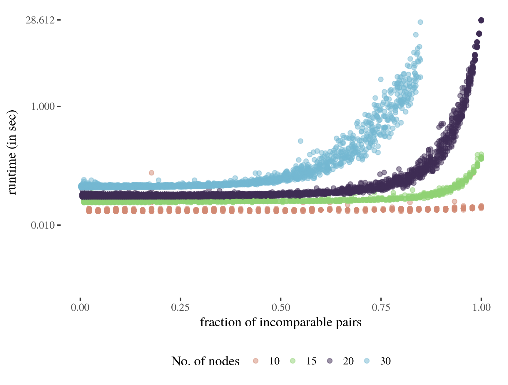
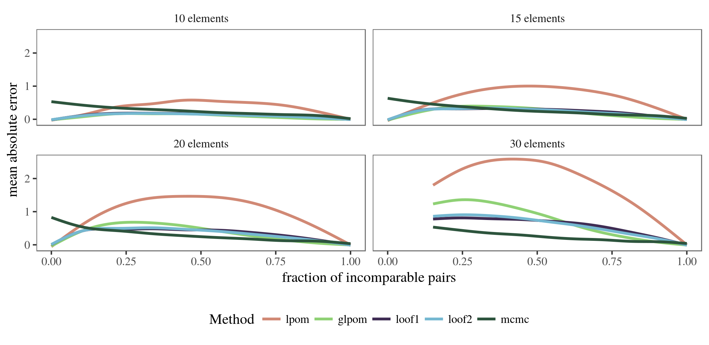
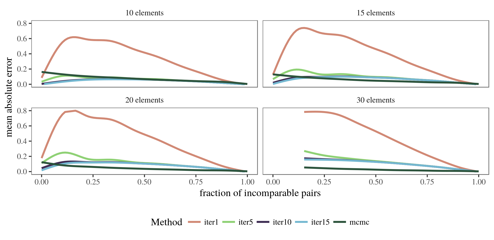

```{r setup,echo=FALSE}
knitr::opts_chunk$set(out.width = "100%")
```

Some of the methods provided in `netrankr` are computationally very expensive.
Computing all rankings of a partial ranking, for instance, is a NP-hard problem
such that using the function `exact_rank_prob()` quickly becomes infeasible. 
This article provides some guidelines for when the use of this function is possible.
Additionally, the quality of the approximation functions `approx_*` and 
sampling rankings with `mcmc_rank_prob()` for **expected ranks**
and **relative rank probabilities** are assessed.

(*The data and code to replicate the benchmark results can be found in the `data-raw` folder on 
[github](https://github.com/schochastics/netrankr/tree/master/data-raw)*)

________________________________________________________________________________

## Runtimes exact probabilities

The below figure shows the runtime of `exact_rank_prob()` for a sample of
3,000 partial rankings with 10 to 20 nodes and varying degree of completeness.

```{r runtime, echo=FALSE}

```

Not surprisingly, the runtime increases quickly with the number of nodes and the
number of incomparable pairs in the partial ranking. As a very crude rule of thumb:
As long as a partial ranking has less than 30 elements, it is always save to run
`exact_rank_prob()`. Beyond 30 elements, it is advisable to only use the function if
a high fraction of pairs of elements is already comparable. The more elements, 
the higher this fraction should be.

________________________________________________________________________________

## Approximating expected ranks

`netrankr` implements five methods to approximate expected ranks which are given
by the functions `approx_rank_expected()` and `mcmc_rank_prob()`. The four methods
implemented in the former are only based on structural features of the partial ranking,
while the latter is based on sampling rankings (almost) uniformly at random from the 
set of all rankings. Consult the help files for a more detailed description and references. 
The below figure shows the (averaged) mean absolute error compared to the exact expected ranks
of the five methods on the set of 3000 partial rankings from above. The number of 
drawn samples for the mcmc function is set to $n^5$, where $n$ is the number of 
elements in the partial ranking.

```{r qual_exp_mse, echo=FALSE}

```

The basic *local partial order model* performs considerably worse than the other 
methods on almost all partial rankings. Its generalized version outperforms 
the methods based on the relative rank probabilities (*loof1* and *loof2*) if
the number of incomparable pairs is high. The mcmc method generally yields the best
approximations, especially with increasing number of elements. However, its 
performance seems to get worse when almost none of the elements are comparable. 
This issue is discussed in the section on choosing the number of samples further down.

________________________________________________________________________________

## Approximating relative ranks

Relative ranks can either be approximated with the iterative function `approx_rank_relative()`
or again via sampling rankings (almost) uniformly at random with `mcmc_rank_prob()`.
The below figure shows the (averaged) mean absolute error compared to the exact 
relative rank probabilities on the set of 13000 partial rankings from above. The number of 
drawn samples for the mcmc function is set to $n^4$, where $n$ is the number of 
elements in the partial ranking. The number of iterative steps in `approx_rank_relative()`
is set to 1 (no iteration), 5, 10 and 15 respectively.
```{r qual_rel, echo=FALSE}

```

Clearly, the non-iterative approximation performs worse on all partial rankings.
The more iterations the better the approximation quality seems to be, yet the gain
in quality going from 10 to 15 iterations seems negligible. The mcmc based function
again performs better except in the region of low comparability.

________________________________________________________________________________

## MCMC sampling of rankings

The results above have shown that approximating expected ranks and relative
rank probabilities on the basis of a random sample generally give the best results,
except in the region of low comparability. This problem can be mitigated by 
increasing the number of samples. The below boxplot shows the mean absolute error
for the expected ranks of an empty partial ranking with 10 elements, when the 
number of samples is increased. For each sample size, 100 repetition were done.
```{r mcmc_samples_exp, echo=FALSE}
knitr::include_graphics("mcmc_samples_exp.png")
```

The same procedure is carried out for the relative ranks below.

```{r mcmc_samples_rel, echo=FALSE}
knitr::include_graphics("mcmc_samples_rel.png")
```

That is, increasing the number of samples (quite naturally) leads to better approximations,
but of course also comes with an increase in running time, especially for larger
partial rankings.

________________________________________________________________________________

## Runtimes of approximation

The function `mcmc_rank_prob()` generally gives the best approximations. The larger the
number of samples, the better. Since the number of samples should be at least
cubic in the number of elements, it is limited to partial rankings with a couple of 
hundred elements.

Although the function `approx_rank_expected()` and `approx_rank_relative()` performed
the worst in the above tests, they are computationally the least expensive with a 
time complexity of $\mathcal{O}(n^2)$. Thus, they are able to at least give a rough
approximation also for partial rankings beyond 1000 elements.

________________________________________________________________________________

## Session info
```{r session,echo=FALSE}
sessionInfo()
```
